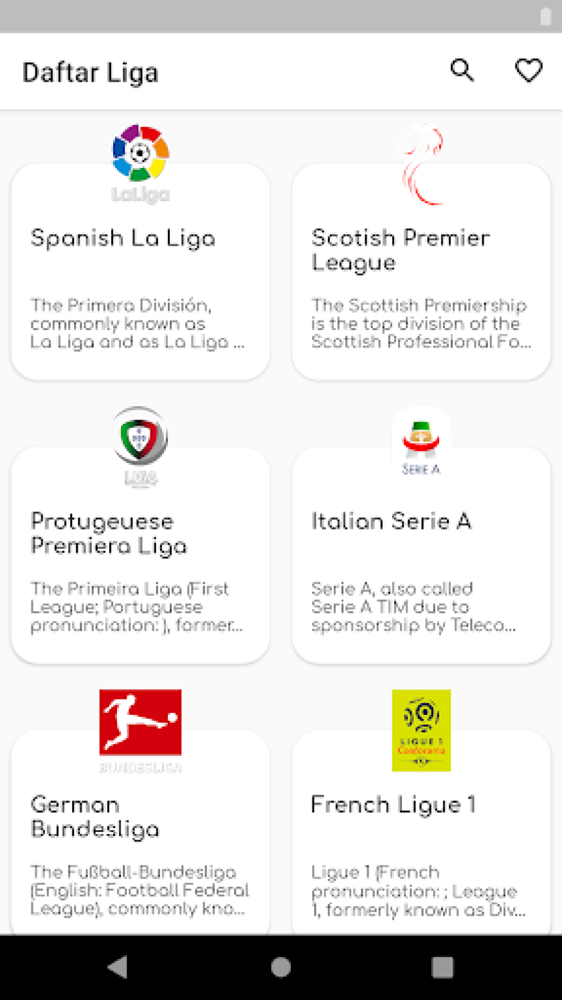
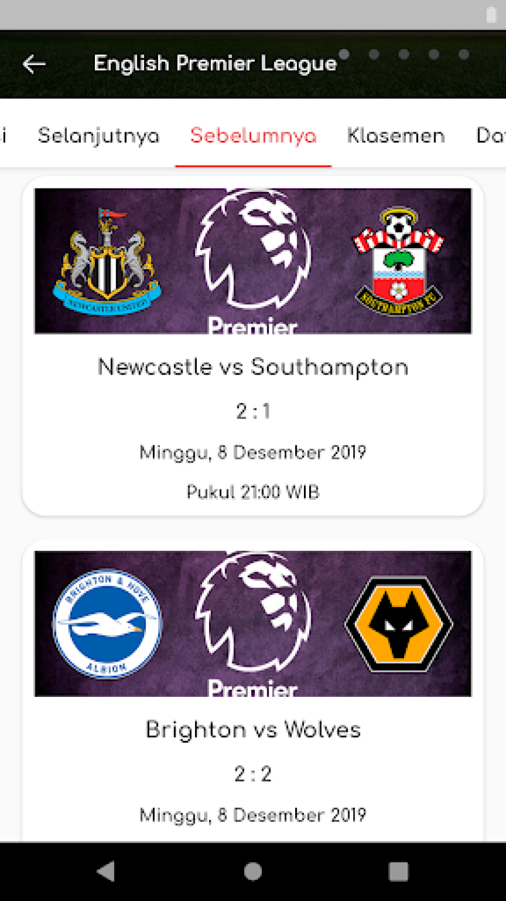
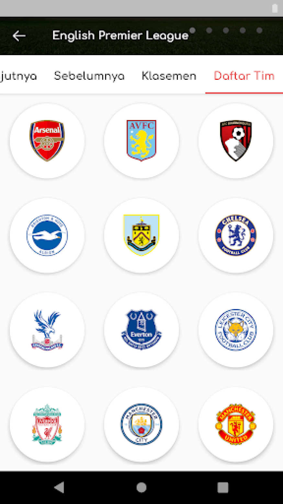
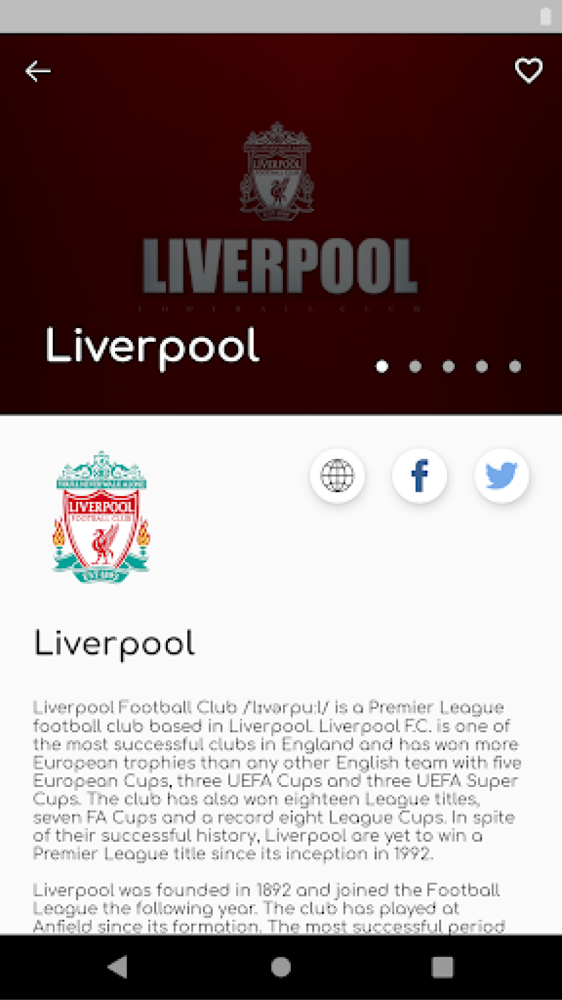
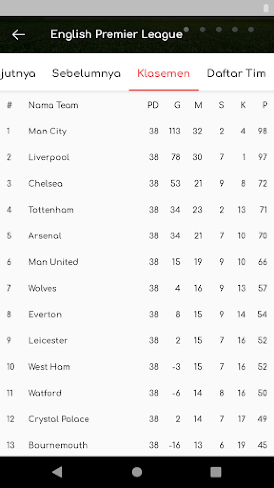
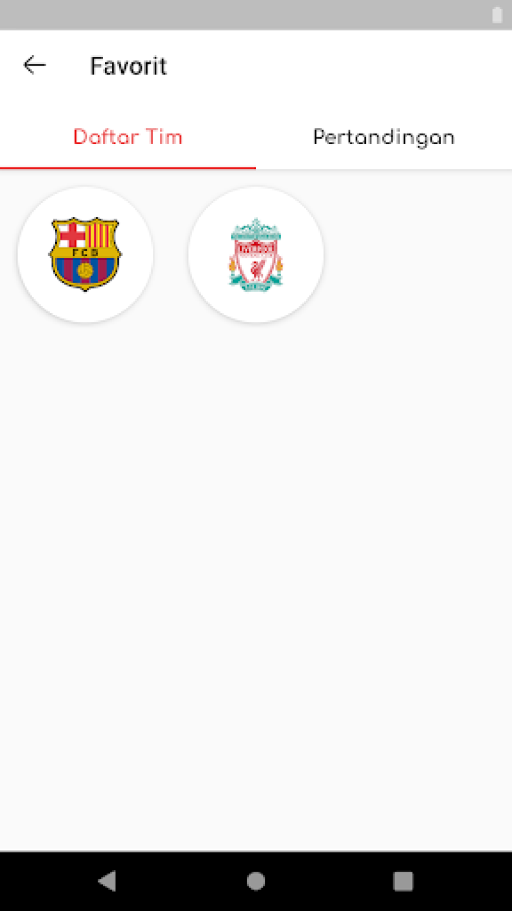
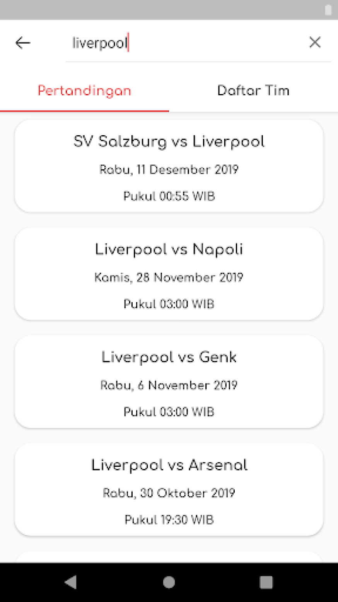

<!--
*** Thanks for checking out this README Template. If you have a suggestion that would
*** make this better, please fork the repo and create a pull request or simply open
*** an issue with the tag "enhancement".
*** Thanks again! Now go create something AMAZING! :D
-->

<!-- PROJECT SHIELDS -->
<!--
*** I'm using markdown "reference style" links for readability.
*** Reference links are enclosed in brackets [ ] instead of parentheses ( ).
*** See the bottom of this document for the declaration of the reference variables
*** for contributors-url, forks-url, etc. This is an optional, concise syntax you may use.
*** https://www.markdownguide.org/basic-syntax/#reference-style-links
-->

<!-- PROJECT LOGO -->
 

  
  <h3 align="center">Football Ku</h3>

  

    This is a sample project for completing <a href="https://www.dicoding.com/">Kotlin Android Developer Expert by Dicoding</a> 
  

  

    
  

<!-- TABLE OF CONTENTS -->
## Table of Contents

* [About The Project](#about-the-project)
* [Features](#features)
* [Built With](#built-with)
* [Contributing](#contributing)
* [License](#license)
* [Contact](#contact)
* [Acknowledgements](#acknowledgements)

<!-- ABOUT THE PROJECT -->
## About The Project

<table>
  <tr>
    <td></td>
    <td></td>
    <td></td>
    <td></td>
  </tr>
  <tr>
    <td align="center">List of League</td>
    <td align="center">Detail league</td>
    <td align="center">List of Match</td>
    <td align="center">List of Team</td>
  </tr>
    <tr>
    <td></td>
    <td></td>
    <td></td>
    <td></td>
  </tr>
  <tr>
    <td align="center">Detail of Team</td>
    <td align="center">Standing</td>
    <td align="center">Favorite Team</td>
    <td align="center">Favorite Match</td>
  </tr>
 </table>

## Features
- List of League.
- List of Team.
- List of Upcoming Match.
- List of Previous Match.
- Favorite Teams.
- Favorite Match.
- Search Teams.
- Search Match.

## Built With
* [Kotlin](https://kotlinlang.org/)
* [Androidx](https://developer.android.com/jetpack/androidx)
* [TheSportDB](https://www.thesportsdb.com/)
* [Room](https://developer.android.com/topic/libraries/architecture/room.html)
* [View Binding](https://developer.android.com/topic/libraries/view-binding)
* [Material Design](https://material.io/design/)
* [Kotlin Coroutines](https://kotlinlang.org/docs/reference/coroutines-overview.html)
* [Glide](https://github.com/bumptech/glide)
* [Retrofit](https://square.github.io/retrofit/)
* [Okhttp](https://square.github.io/okhttp/)
* [Gson](https://github.com/google/gson)
* [Anko](https://github.com/Kotlin/anko)
* [Multiline Collapsing Toolbar layout](https://github.com/opacapp/multiline-collapsingtoolbar)

<!-- CONTRIBUTING -->
## Contributing

1. Fork the Project
2. Create your Feature Branch (`git checkout -b feature/AmazingFeature`)
3. Commit your Changes (`git commit -m 'Add some AmazingFeature'`)
4. Push to the Branch (`git push origin feature/AmazingFeature`)
5. Open a Pull Request

<!-- LICENSE -->
## License

Distributed under the MIT License. See `LICENSE` for more information.

<!-- CONTACT -->
## Contact

Anang Kurniawan - [@anang_kur](https://twitter.com/anang_kur) - anangk97@gmail.com

<!-- MARKDOWN LINKS & IMAGES -->
<!-- https://www.markdownguide.org/basic-syntax/#reference-style-links -->
[contributors-shield]: https://img.shields.io/github/contributors/othneildrew/Best-README-Template.svg?style=flat-square
[contributors-url]: https://github.com/othneildrew/Best-README-Template/graphs/contributors
[forks-shield]: https://img.shields.io/github/forks/othneildrew/Best-README-Template.svg?style=flat-square
[forks-url]: https://github.com/othneildrew/Best-README-Template/network/members
[stars-shield]: https://img.shields.io/github/stars/othneildrew/Best-README-Template.svg?style=flat-square
[stars-url]: https://github.com/othneildrew/Best-README-Template/stargazers
[issues-shield]: https://img.shields.io/github/issues/othneildrew/Best-README-Template.svg?style=flat-square
[issues-url]: https://github.com/othneildrew/Best-README-Template/issues
[license-shield]: https://img.shields.io/github/license/othneildrew/Best-README-Template.svg?style=flat-square
[license-url]: https://github.com/othneildrew/Best-README-Template/blob/master/LICENSE.txt
[linkedin-shield]: https://img.shields.io/badge/-LinkedIn-black.svg?style=flat-square&logo=linkedin&colorB=555
[linkedin-url]: https://linkedin.com/in/othneildrew
